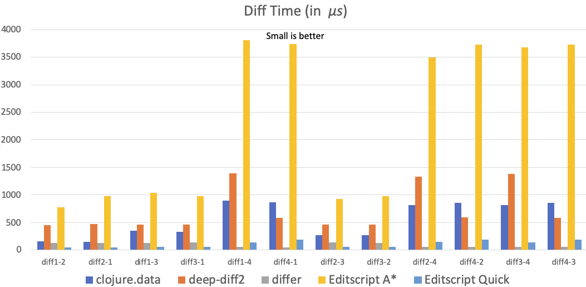
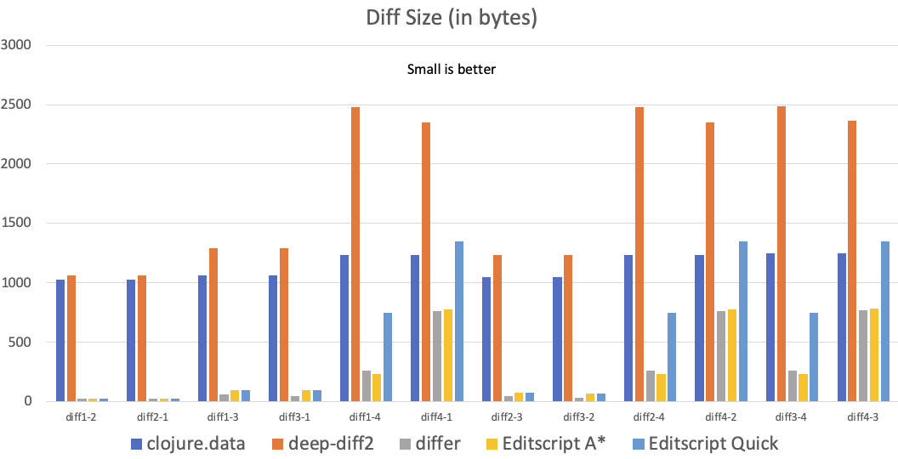

<p align="center"></img></p>
<h1 align="center">Editscript</h1>
<p align="center">🔦  Diff and patch for Clojure/Clojurescript data. 🧩	</p>

<p align="center">
<a href="https://badge.fury.io/js/clj-editscript"></img></a>
<a href="https://cljdoc.org/d/juji/editscript/CURRENT"></img></a>
</p>
<p align="center">
<a href="https://clojars.org/juji/editscript"></img></a>
</p>

## :hear_no_evil: What is it?
Editscript is a library designed to extract the differences between two Clojure/Clojurescript
data structures as an "editscript", which represents the minimal modification
necessary to transform one to another. Currently, the library can diff and patch
any nested Clojure/Clojurescript data structures consisting of regular maps,
vectors, lists, sets and values. Custom data can also be handled if you implement our protocols.


## :tada: Usage

See my [Clojure/North 2020 Talk](https://youtu.be/n-avEZHEHg8): Data Diffing Based Software Architecture Patterns.

```Clojure
(use 'editscript.core)
(use 'editscript.edit)

;; Here are two pieces of data, a and b
(def a ["abc" 24 22 {:a [1 2 3]} 1 3 #{1 2}])
(def b [24 23 {:a [2 3]} 1 3 #{1 2 3}])

;; compute the editscript between a and b using the default A* algorithm
(def d (diff a b))

d
;;==>
;;[[[0] :-]
;; [[1] :r 23]
;; [[2 :a 0] :-]
;; [[5 3] :+ 3]]

;; compute the editscript between a and b using the quick algorithm
(def d-q (diff a b {:algo :quick}))

d-q
;;=>
;;[[[0] :-]
;; [[1] :r 23]
;;[[2 :a 0] :-]
;;[[5 3] :+ 3]]

;; get the edit distance, i.e. number of edits
(edit-distance d)
;;==> 4

;; get the size of the editscript, i.e. number of nodes
(get-size d)
;;==> 22

;; patch a with the editscript to get back b, so that
(= b (patch a d))
;;==> true
(= b (patch a d-q))
;;==> true

```

An Editscript contains a vector of edits, where each edit is a vector of two or three
elements.

The first element of an edit is the path, similar to the path vector in the
function call `update-in`. However, `update-in` only works for associative data
structures (map and vector), whereas the editscript works for map, vector, list
and set alike.

The second element of an edit is a keyword representing the edit operation,
which is one of `:-` (deletion), `:+` (addition), and `:r `(replacement).

For addition and replacement operation, the third element is the value of new data.

```Clojure

;; get the edits as a plain Clojure vector
(def v (get-edits d))

v
;;==>
;;[[[0] :-]
;; [[1] :r 23]
;; [[2 :a 0] :-]
;; [[5 3] :+ 3]]

;; the plain Clojure vector can be passed around, stored, or modified as usual,
;; then be loaded back as a new EditScript
(def d' (edits->script v))

;; the new EditScript works the same as the old one
(= b (patch a d'))
;;==> true

```

## :shopping: Alternatives

Depending on your use cases, different libraries in this space may suit you needs better. The `/bench` folder of this repo contains a benchmark comparing the alternatives. The resulting charts of [the benchmark](https://juji.io/blog/comparing-clojure-diff-libraries/) are included below:




[deep-diff2](https://github.com/lambdaisland/deep-diff2) applies Wu et al. 1990 [3] algorithm by first converting trees into linear structures. It is only faster than A\* algorithm of Editscript. Its results are the largest in size. Although unable to achieve optimal tree diffing with this approach, it has some interesting use, e.g. visualization. So if you want to visualize the differences, use deep-diff2. This library does not do patch.

[clojure.data/diff](https://clojuredocs.org/clojure.data/diff) and [differ](https://github.com/Skinney/differ) are similar to the quick algorithm of Editscript, in that they all do a naive walk-through of the data, so the generated diff is not going to be optimal.

clojure.data/diff is good for detecting what part of the data have been changed and how. But it is slow and the results are also large. It does not do patch either.

differ looks very good by the numbers in the benchmark. It does patch, is fast and the results the smallest (for it doesn't record editing operators). Unfortunately, it cuts corners. It fails all the property based tests, even if the tests considered only vectors and maps. Use it if you understand its failing patterns and are able to avoid them in your data. 

Editscript is designed for data diffing, e.g. data preservation and recovery, not for being looked at by humans. If speed is your primary concern, the quick algorithm of Editscript is the fastest among all the alternatives, and its diff size is reasonably small for the benchmarked data sets. If the diff size is your primary concern, A\* algorithm is the only available option that guarantees optimal data size, but it is also the slowest.

## :zap: Diffing Algorithms

The library currently implements two diffing algorithms. The default algorithm
produces diffs that are optimal in the number of editing operations and the
resulting script size. A quick algorithm is also provided, which does not
guarantee optimal results but is very fast.

### A\* diffing

This A\* algorithm aims to achieve optimal diffing in term of minimal size of resulting
editscript, useful for storage, query and restoration. This is an original
algorithm that has some unique properties: unlike many other general tree
differing algorithms such as Zhang & Shasha 1989 [4], our algorithm is structure preserving.

Roughly speaking, the edit distance is defined on sub-trees rather than nodes,
such that the ancestor-descendant relationship and tree traversal order are
preserved, and nodes in the original tree does not split or merge. These
properties are useful for diffing and patching Clojure's immutable data
structures because we want to leverage structure sharing and use `identical?`
reference checks. The additional constraints also yield algorithms with better run time
performance than the general ones. Finally, these constraints feel natural for a
Clojure programmer.

The structure preserving properties were proposed in Lu 1979 [1] and Tanaka 1995 [2].
These papers describe diffing algorithms with O(|a||b|) time and space
complexity. We designed an A\* based algorithm to achieve some speedup. Instead
of searching the whole editing graph, we typically search a portion of it along
the diagonal.

The implementation is optimized for speed. Currently the algorithm spent most of
its running time calculating the cost of next steps, perhaps due to the use of a very
generic heuristic. A more specialized heuristic for our case should reduce the number of
steps considered. For special cases of vectors and lists consisting of leaves
only, we also use the quick algorithm below to enhance the speed.

Although much slower than the non-optimizing quick algorithm below, the algorithm is
practical for common Clojure data that include lots of maps. Maps and sets do
not incur the penalty of a large search space in the cases of vectors and lists.
For a [drawing data set](https://github.com/justsml/json-diff-performance), the
diffing time of the algorithm is in the range of 2ms to 4ms on a 2014 2.8 GHz
Core i5 16GB MacBook Pro.

### Quick diffing

This quick diffing algorithm simply does an one pass comparison of two trees so
it is very fast. For sequence (vector and list) comparison, we implement Wu et
al. 1990, an algorithm with O(NP) time complexity, where P is the
number of deletions if `b` is longer than `a`.  The same sequence diffing algorithm is
also implemented in [diffit](https://github.com/friemen/diffit). Using their
benchmark, our implementation has slightly better performance due to more
optimizations. Keep in mind that our algorithm also handles nested Clojure data
structures. Compared  with our A\* algorithm, our quick algorithm is up to two
orders of magnitude faster.

The Wu algorithm does not have replacement operations, and assumes each edit has
a unit cost. These do not work well for tree diffing. Consequently, the quick
algorithm does not produce optimal results in term of
script size. In principle, simply changing a pointer to point to `b` instead of
`a` produces the fastest "diffing" algorithm of the world, but that is not very
useful. The quick algorithm has a similar problem.

For instances, when consecutive deletions involving nested elements occur in a
sequence, the generated editscript can be large. For example:

```Clojure
(def a [2 {:a 42} 3 {:b 4} {:c 29}])
(def b [{:a 5} {:b 5}])

(diff a b {:algo :quick})
;;==>
;;[[[0] :-]
;; [[0] :-]
;; [[0] :-]
;; [[0 :b] :-]
;; [[0 :a] :+ 5]
;; [[1 :c] :-]
;; [[1 :b] :+ 5]]

(diff a b)
;;==>
;;[[[0] :-]
;; [[0 :a] :r 5]
;; [[1] :-]
;; [[1 :b] :r 5]
;; [[2] :-]]

```
In this case, the quick algorithm seems to delete the original and then add
new ones back. The reason is that the quick algorithm does not drill down
(i.e. do replacement) at the correct places. It currently drills down wherever it
can. An optimizing algorithm is needed if minimal diffs are desired.

## :station: Platform

The library supports JVM Clojure and Clojurescript. The later has been tested
with node, nashorn, chrome, safari, firefox and lumo. E.g. run our test suite:

```bash
# Run Clojure tests
lein test

# Run Clojurescript tests on node.js
lein doo node

# Run Clojurescript tests on chrome
lein doo chrome browser

```

## :bulb: Rationale

At Juji, we send changes of UI states back to server for persistence [see blog post](https://juji.io/blog/this-is-how-we-revamped-the-ui-in-less-than-a-month/). Such a use case requires a good diffing library for nested Clojure
data structures to avoid overwhelming our storage systems. I have not found such
a library in Clojure ecosystem, so I implemented my own. Hopefully this little
library could be of some use to further enhance the Clojure's unique
strength of [Data-Oriented Programming](https://livebook.manning.com/#!/book/the-joy-of-clojure-second-edition/chapter-14/1).

Editscript is designed with stream processing in mind. An editscript should be
conceptualized as a chunk in a potentially endless stream of changes. Individual
editscripts can combine (concatenate) into a larger edistscript. I consider
editscript as a part of a larger data-oriented effort, that tries to elevate
the level of abstraction of data from the granularity of characters, bytes or
lines to that of maps, sets, vectors, and lists. So instead of talking about
change streams in bytes, we can talk about change streams in term of higher level data
structures.

## :roller_coaster: Roadmap

There are a few things I have some interest in exploring with this library. Of course, ideas,
suggestions and contributions are very welcome.

* Further speed up of the algorithms, e.g. better heuristic, hashing, and so on.
* Support other data types as collection types, e.g. strings.
* Globally optimize an editscript stream.

## :green_book: References

[1] Lu, S. 1979, A Tree-to-tree distance and its application to cluster analysis. IEEE Transactions on Pattern Analysis and Machine Intelligence. Vol. PAMI-1 No.2. p219-224

[2] Tanaka, E., 1995, A note on a tree-to-tree editing problem. International
 Journal of Pattern Recognition and Artificial Intelligence. p167-172

[3] Wu, S. et al., 1990, An O(NP) Sequence Comparison Algorithm, Information Processing Letters, 35:6, p317-23.

[4] Zhang, K. and Shasha, D. 1989, Simple fast algorithms for the editing distance between trees and related problems. SIAM Journal of Computing, 18:1245–1262


## License

Copyright © 2018-2020 Juji, Inc.

Distributed under the Eclipse Public License either version 1.0 or (at
your option) any later version.
